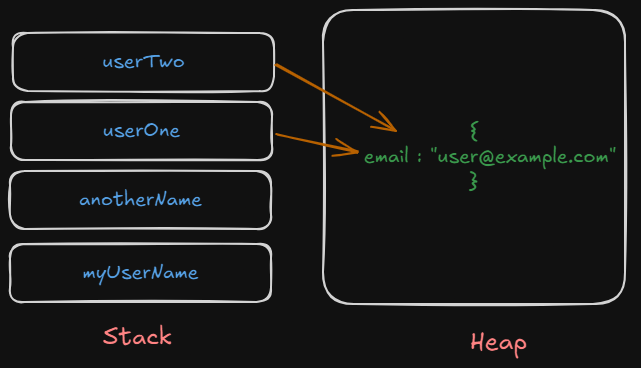

# Stack (Primitive), Heap (Non-Primitive)

```js 
let myUserName = "ashish";

let anotherName = myUsername;

console.log(anotherName); // ashish

anotherName = "shrestha";

console.log(myUserName); // ashish
console.log(anotherName); // shrestha

let userOne = {
    email : "user@example.com"
};

let userTwo = userOne;
userTwo.email = "user123@example.com";

console.log("userOne.email"); // user123@example.com
console.log("userTwo.email"); // user123@example.com
```

