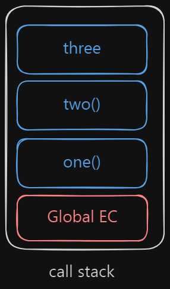

# JavaScript Execution Context

-   Global Execution Context refers to `this`.
-   Mainly, there are:
    -   Global Execution Context
    -   Function Execution Context
    -   Eval Execution Context
-   JavaScript Code runs in two phases:
    -   Memory Creation Phase
    -   Execution Phase

## Example

```js
let val1 = 10;
let val2 = 20;

function addNum(num1, num2) {
    let total = num1 + num2;
    return total;
}

let result1 = addNum(val1, val2);
let result2 = addNum(2, 4);
```

1. Global Execution Context [Global Environment]
    - code runs from `Global Execution` and allocated to `this`
2. Memory Creation Phase [Creation Phase]
    - `val1` = undefined
    - `val2` = undefined
    - `addNum` = function definition
    - `result1` = undefined
    - `result2` = undefined
3. Execution Phase
    - `val1` = 10
    - `val2` = 20
    - `addNum`
        - [New Variable Environment + Execution Thread]
            1. Memory Creation Phase
                - `val1` = undefined
                - `val2` = undefined
                - `total` = undefined
            2. Execution Context
                - `num1` = 10
                - `num2` = 20
                - `total` = 30
    - `result1` = 30
    - `addNum`
    - `result2` = 6

# Call Stack

## Example

```js
function one() {
    console.log("one");
}
function two() {
    console.log("two");
}
function three() {
    console.log("three");
}

one();
two();
three();
```


