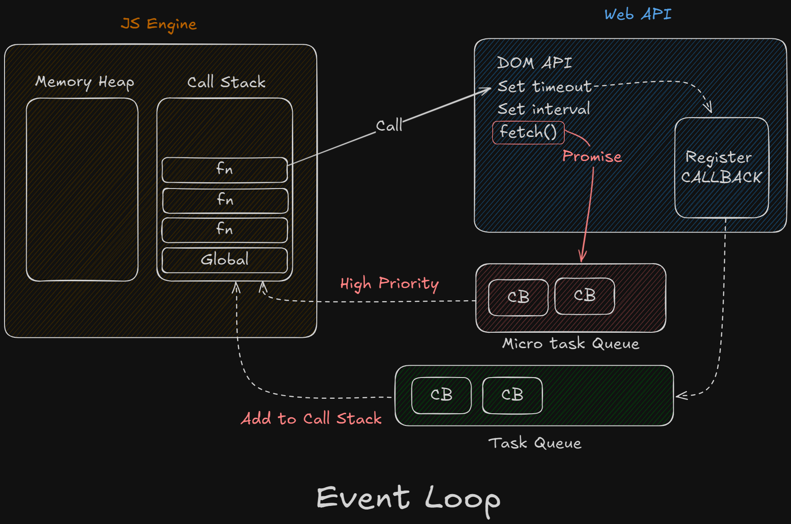

# Asynchronous JavaScript

-   In default, JavaScript is
    -   Synchronous
    -   Single Threaded Language
-   Execution Context - JavaScript executes one line of code at a time
    

## Blocking Code vs Non Blocking Code

-   Blocking Code
    -   Block the flow of program
    -   Read file synchronous
-   Non Blocking Code
    -   Does not block execution
    -   Read file asynchronous

## Event Loop

